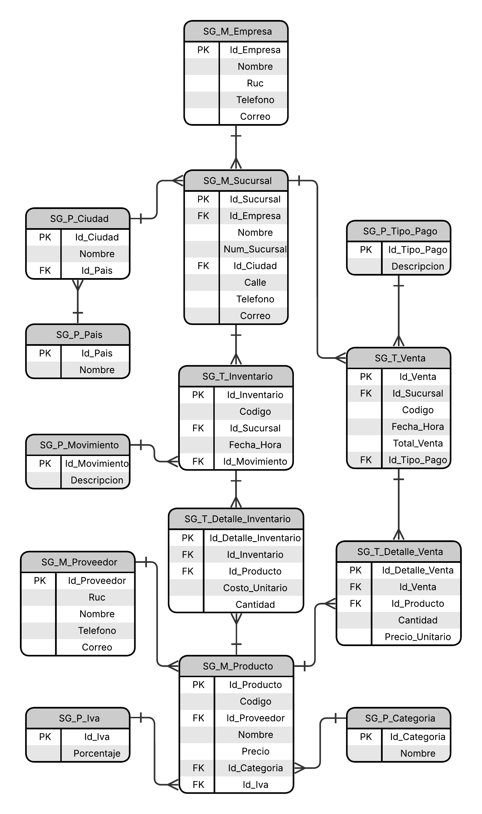

# Supermarket Sales Management System

RESTful API developed with Spring Boot for comprehensive sales management in a supermarket chain.

> **Final Project** for the "API Development with Spring Boot" course at TodoCode Academy

## Objective

Develop a complete REST API that implements CRUD operations with JPA, entity relationships, error handling, and REST best practices, applying functional programming with lambdas and streams.

## Database Design

The project begins with an exhaustive data model analysis, considering:

- **Normalization**
- **Ecuadorian legal context**
- **Business scalability**
- **Nomenclature** by table type (Master, Parametric, Transactional)

### Entity-Relationship Model

*The model covers complete management of products, branches, inventory, sales, and their relationships.*

## Main Entities

### Master Tables (M)
- **Company**: Legal information of the chain (RUC, corporate name)
- **Branch**: Physical establishments with SRI numbering
- **Product**: Product catalog with prices and taxes
- **Supplier**: Product distributors

### Parametric Tables (P)
- **Country / City**: Geographic location
- **VAT**: Applicable tax rates
- **Payment Type**: Available payment methods
- **Movement Type**: Inventory operation classification

### Transactional Tables (T)
- **Sale**: Sales transaction records
- **Sale Detail**: Products sold per transaction
- **Inventory**: Stock movements per branch

## Technology Stack

- **Java 25**
- **Spring Boot 4.0.2**
- **Spring Data JPA / Hibernate**
- **PostgreSQL 18**
- **Maven**
- **Lombok**

## Design Decisions

### Why include the Company entity?
In Ecuador, the RUC (Unique Taxpayer Registry) belongs to the parent company, not to each branch. Each branch is an "establishment" under the same RUC with specific SRI numbering. This reflects Ecuadorian tax and legal reality.

### Why Inventory as a transactional table?
Although movements are not constantly recorded, each record represents an **event** (stock entry/exit) that occurred at a specific time. Frequency doesn't define table type, but rather the nature of the data.

### Why Supplier as a master table?
In a real supermarket, suppliers have their own identity with RUC, contracts, payment terms, etc. They are entities that the business actively manages, not simple references.

## Author

**Emanuel Tito**
- GitHub: [@emanueltitodev](https://github.com/EmanuelTitoDev)
- Email: emanuel.tito.dev@outlook.com

## License

This project is licensed under the MIT License - see the [LICENSE](LICENSE) file for details.
